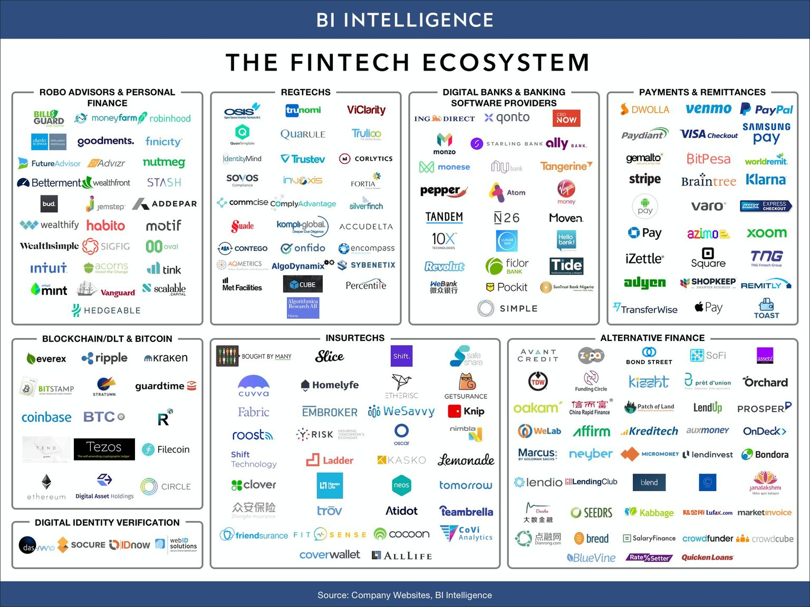

## Fintech Industry

### Major Trends
Fintech sector has seen remarkable growth in cloud and core-processing solutions as shifting consumer preferences drive widespread adoption.
Adoption and investment in AI, Blockchain, and ML are on the rise. The industry has witnessed a decline in new payment solutions and robo-advising offerings as the more established firms in the space have deterred new competition as well as scarce access to funding.

#### Modern Trends
The move to passive management means shrinking revenue and profits in the industry and therefore fintech firms must fight hard for revenue.
##### Policies that present new opportunities or challenges to fin-tech firms
An overlooked tax law — Sec. 1244 — that de-risks angel investing is due to be indexed to inflation from the current levels last indexed in 1978. When this happens, more family office monies will flow into the Seed/A rounds of startups, filling the funding gap that exists, particularly outside Silicon Valley, NYC/Boston and LA

Regulatory reform will help push innovation and investments into different areas. Also, spending cuts mean that people need to do more with less. This shift could be a net positive for technology companies in the longer term

Huge opportunities with the new administration. Corporate taxes, repatriation of assets, better entrepreneurial environment

The biggest change facing the advisor community is the Department of Labor regulatory change to apply fiduciary standards to retirement accounts. For us at Apex, this creates an enormous opportunity as it forces the wealth management community to change towards a more digital world especially for the smaller accounts they service

##### Block chain's adoption
Blockchain will eventually revolutionize the financial services industry. It will take many, many years, though. Unfortunately, unless the utilities (Depository Trust Clearing Corp., Options Clearing Corp., etc.) and the largest banks embrace and implement this, we are only as good as our weakest link

Although we may not see a mainstream application immediately, but blockchain as a technology has the ability to bring about large scale disruption in multiple sectors such as improving supply chain traceability in food, curbing piracy in the entertainment industry as well as safer and faster transactions in real-estate

##### Specific applications that fintechs that have material influence and can trully disrupt the industry
The venture funding model is evolving and will finally be adopting more institutional/public market practices

Blockchain, payments and lending.

Blockchain middleware

Portfolio and risk management. There is nothing out there, except Zoonova, for the average person to use in a web cloud environment that is affordable. This sector of fintech is currently dominated by Bloomberg, Thomson Reuters, and various software companies

 Fintech is almost only about incremental improvement, but they accumulate to a point where it becomes disruptive.

 Investment research has not changed since the days of JP Morgan over a century ago. We have computers and more data now, but fundamental research is virtually identical. Fintech firms can and should disrupt this model, streamline the research process and mitigate human biases

 Wealth management. Fees should fall and service should improve. Rebalancing and asset management will become commoditized

 Retail banking fintech is starting to reach a maturation point. The next wave of fintech firms will focus on capital markets and the institutional trading spaces. There is plenty of room for innovation and disruption in these areas

 #### Alarming Fintech Trends
 Bitcoin and blockchain technology was not on my radar in the previous years but that is a space that has great momentum at this point and seems like is a trend which is here to stay (at least for the next few years).

 Every bank now wants to have their own pocket robo-advisor

It is a bit of the opposite. In 2013-15 it felt like many trends were just around the corner. Like any heavily regulated industry, change takes much more time than the innovators predict. The slowing of adoption of blockchain, bank disintermediation, and passive investment wealth managers (Wealthfront/Acorn) is the more noticeable change in the past year. Not that they aren’t growing still, but that they aren’t here yet

There may be a slowing of robo-investor growth as the market becomes crowded and the buzz fades. This combined with average performance may cause investors to seek higher performance alternatives.

More and more fintech companies build their products around their data mining, analysis and predicting capabilities, for example in the insurance and investment industries, but also business intelligence and more. Specifically, the applications of artificial intelligence and machine learning techniques are very much on the rise

Automation. Established companies need to automate their funnels to allow themselves further reach, increased revenues and decrease costs. As other companies expand into the industry, they require automation to help bridge their knowledge gap and initial human capital investment

#### Fintech Companies To Model
Bloomberg for it adoption and long running price inelasticity

Sofi for its ability to expand like a bank without being one

Poundwise, symphony, Trendrating, alpha sense, eToro and Motif

AlphaSense. As a former M&A banker, I know the torture of Ctrl+F’ing through 10Ks and 10Qs. It’s horrible and AlphaSense reduces that pain

Robinhood is a greater leader in this space as they are democratizing access to the markets while driving down the price of access for retail.

Funding Circle: They give the current funding needs a nice interactive twist. Easy connection from investor to investment seeking company.

#### Fintech Companies To Pay Attention To
Quovo. I am a big fan of this firm. They tout themselves as the “Data platform for the future of finance

Palantir: Able to generate revenues from big data and security concerns continue

Alta5

Xinfint. They are building an ecosystem that, if done right, could change how new fintech applications get built and consumed.

Cadre: Real-estate crowd funding seems interesting. Credit scores and identity are very interesting! Anything in the sharing economy seems interesting but I don’t know if that’s necessarily fintech...

Benzinga, Daily Fintech & Fintech Genome
